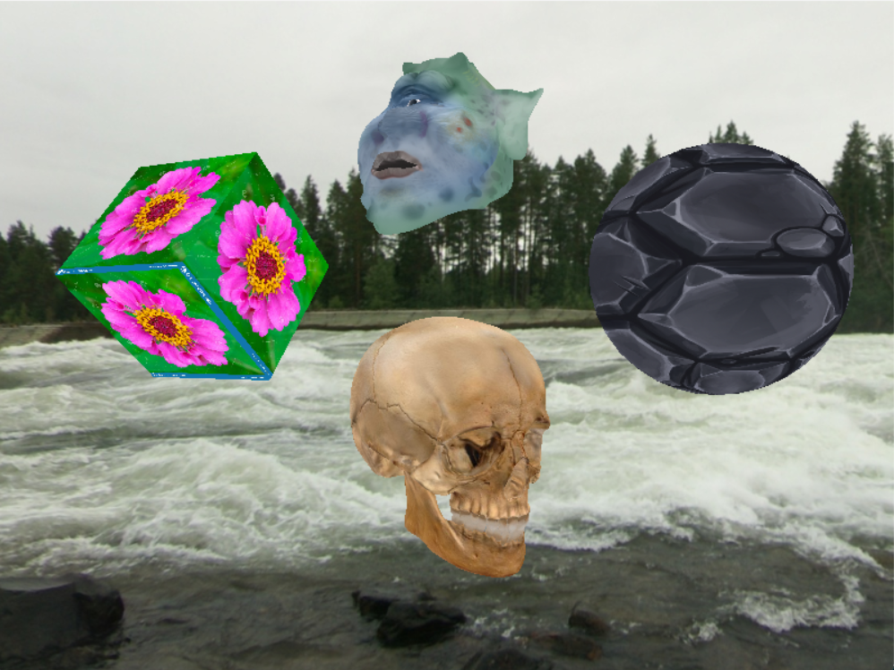

# Capstone!

## Summary
This project is my Capstone Project for Neumont College of Computer Science.
The purpose of my capstone was to learn about renderering technologies,
and specifically about Direct3D11. Although I took a class about computer
graphics, I felt that I didn't understand it well enough and wanted to
gain a deeper understanding.

I also wanted an opportunity to use C++ more. I have used the language for
several classes in the past, but it is a deep and complicated language and
since it is very widely used I thought it wise to learn it better.

## Features
This project essentially turned into a rudimentary scene editor. The user
edit models translation, rotation, and scale at runtime, as well as changing
most aspects of a scene from its yaml text file.
* Loads most standard model file types using [assimp](https://github.com/assimp/assimp).
* Live scene editing, saving, and reloading.
* Realtime lighting and shadow maps (WIP)
* Loads and saves scenes in yaml using [yaml-cpp](https://github.com/jbeder/yaml-cpp).
* Loads most standard image formats for textures using [stb_image](https://github.com/nothings/stb).

## Planned Features and changes
* GUI using [Dear ImGui](https://github.com/ocornut/imgui).
* Switch to [glm](https://github.com/g-truc/glm) math library (instead of directxmath).
* Resource system
* Entity Component System

## Reflection
When deciding which API to use there were four major options: Direct3D11,
Direct3D12, OpenGL, and Vulkan. Under advisement from a friend I chose
Direct3D11 because, OpenGL is deprecated, and both Vulkan and Direct3D12
are a step up in complexity, therefore making Direct3D11 an obvious choice.

On reflection I think I could have learned what I wanted to by using OpenGL,
and may have been able to do so in less time since learning materials for
OpenGL seem to be more readily available. MSDN documentation seems to be
somewhat outdated and not very beginner friendly. I did make use of a textbook
(Introduction to 3D Game Programming with DirectX11 by Frank Luna), however,
it was published in 2012. Most of the main concepts were the same, but there
were important sections which were entirely out of date. Fortunately I was
able to supplement my learning from Luna and MSDN with YouTube videos and
other online resources, and the invaluable indispensable help from my friend
and classmate [Alan Buechner](https://github.com/alanBuechner), as well as
my teacher, Professor Raymond Maple.

If I continue to work on this project after I finish capstone, I have two
ideas for where I could take it.

1. I may simplify the code as much as I can and make it a self contained
tutorial, with heavy commenting to explain each part to a beginner. I
enjoy teaching others and sharing my knowledge, and this was a difficult
topic for me to learn. Perhaps this could be a tool for other people to learn
without facing the same challenges. In addition I would be forced to learn
the material more deeply to sufficiently explain it to another person.
2. This project could easily lead into a game engine. Of course rendering
some models in a scene is a huge step away from being an engine, and there
is a lot more to do, but it's a start and would give me a good project to
work on in spare time.
